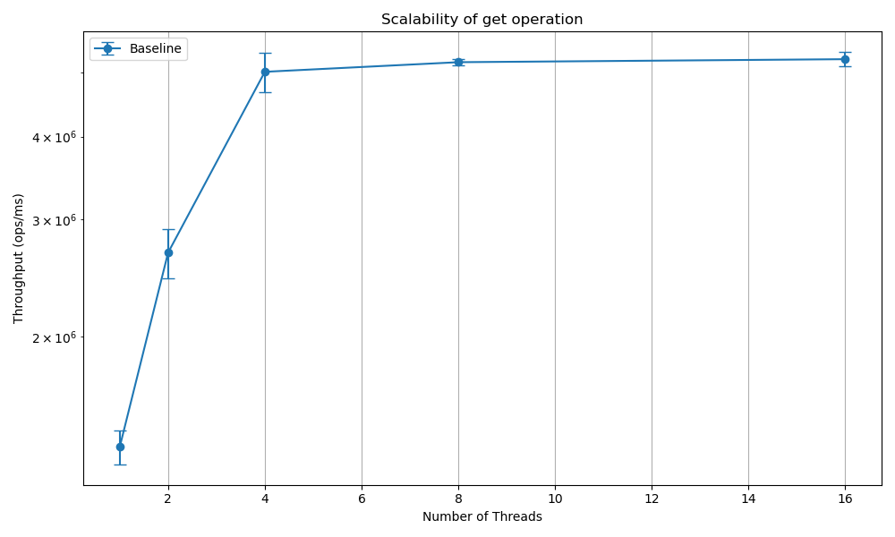
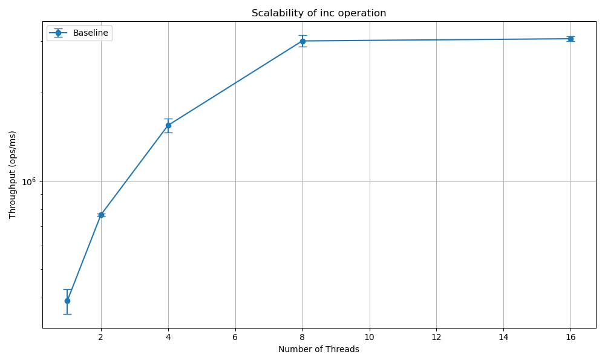
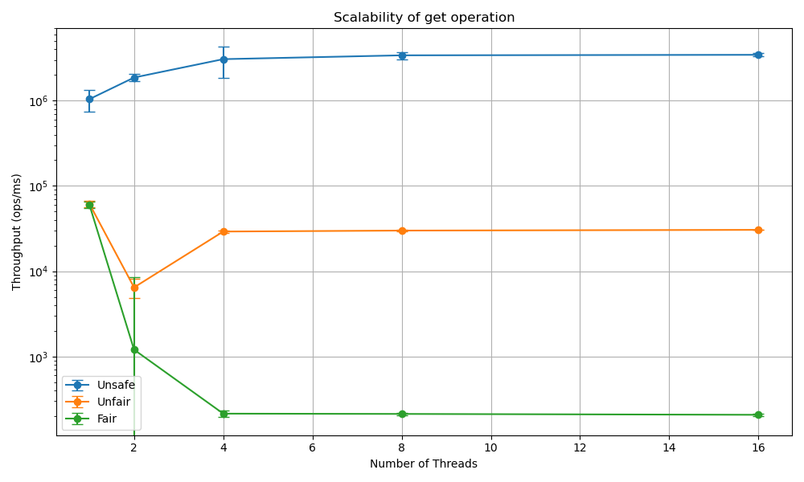
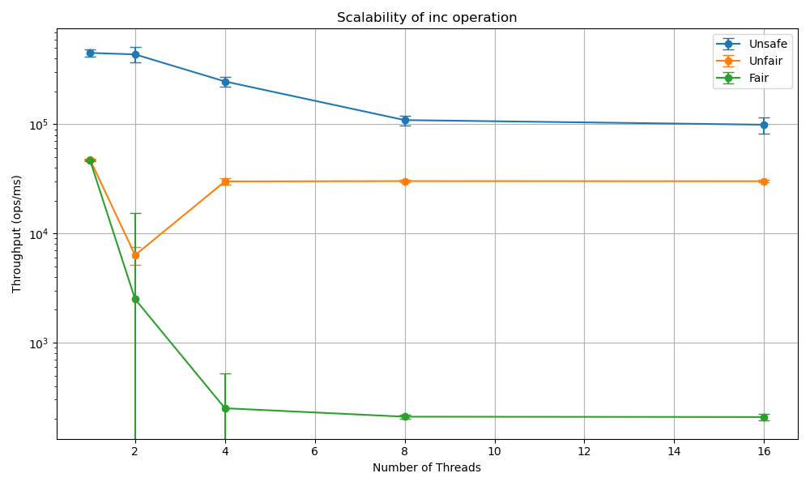

## 1. No Contention Baseline

В данном эксперименте каждый поток работает с собственной копией счетчика, поэтому потоки не конкурируют за общие данные.
На графиках видно, что пропускная способность растет линейно, пока хватает аппаратных ресурсов.

---

## 2. Shared Counters Benchmark

* **Dead Code Elimination:** Чтобы компилятор не вырезал код теста, метод `get` в бенчмарке возвращает значение типа `long`. JMH поглощает возвращаемое значение, что гарантирует реальное выполнение кода чтения памяти.
* **Масштабируемость:** `Unsafe` `get` масштибурется, но вскоре выходит на плато. `Unsafe` `inc` и `Fair`/`Unfair` реализации не масштабируются.
* **Переподписка:** В случае переподписки (16 потоков) ситуация не меняется.
* **Масштабируемость inc vs get:** Операция `get` масштабируется лучше, чем `inc`.
* **Single threaded performance gap:** Между однопоточным выполнением потокобезопасной и небезопасной реализаций существует разрыв в производительности. `Fair` и `Unfair` работают примерно в 10 раз медленнее, чем `Unsafe` из-за оверхеда на синхронизацию памяти (в том числе инвалидация кешей). Этот разрыв не зависит от типа операции.
* **Performance gap Fair vs Unfair:** Нечестная блокировка обеспечивает десятки тысяч операций в миллисекунду, тогда как честная падает до сотен операций. Эта разница объясняется стоимостью переключения контекста, которое происходит чаще при честной блокировке для понижения голодания тредов.